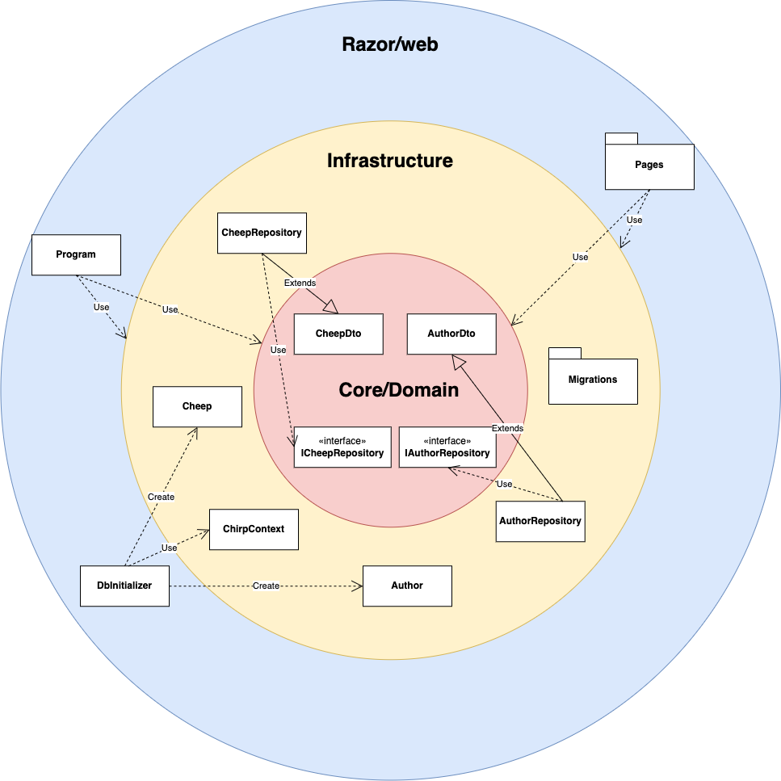

- [Design and Architecture of _Chirp!_](#design-and-architecture-of-chirp)
  - [Domain model](#domain-model)
  - [Architecture — In the small](#architecture--in-the-small)
  - [Architecture of deployed application](#architecture-of-deployed-application)
  - [User activities](#user-activities)
  - [Sequence of functionality/calls trough _Chirp!_](#sequence-of-functionalitycalls-trough-chirp)
- [Process](#process)
  - [Build, test, release, and deployment](#build-test-release-and-deployment)
  - [Team work](#team-work)
  - [How to make _Chirp!_ work locally](#how-to-make-chirp-work-locally)
  - [How to run test suite locally](#how-to-run-test-suite-locally)
    - [Unit and integration tests](#unit-and-integration-tests)
    - [UI tests (E2E)](#ui-tests-e2e)
- [Ethics](#ethics)
  - [License](#license)
  - [LLMs, ChatGPT, CoPilot, and others](#llms-chatgpt-copilot-and-others)

# Design and Architecture of _Chirp!_

## Domain model

Here comes a description of our domain model.


[](http://tinyurl.com/yrawyrfh)<!---->

## Architecture — In the small


## Architecture of deployed application

"Illustrate the architecture of your deployed application. Remember, you developed a client-server application. Illustrate the server component and to where it is deployed, illustrate a client component, and show how these communicate with each other."


[](http://tinyurl.com/ykof3tdp)<!---->

## User activities
[](http://tinyurl.com/ylttngjo)<!---->

[](http://tinyurl.com/ysrr6qql)<!---->

[](http://tinyurl.com/ymzb2ybw)<!---->

## Sequence of functionality/calls trough _Chirp!_

# Process

## Build, test, release, and deployment

### Building and testing the application

[](http://tinyurl.com/yonnhmtn)<!---->

Whenever a push is made to GitHub, a workflow will start testing the application. This is the case for every branch and makes sure that whenever we make something - even if it is a new feature - the tests will run and the program won't fail when merged to main. This only includes the Chirp.Testing-folder as we had issues with GitHub-login for the UI-testing-workflow.

### Automatiting GitHub releases

[](http://tinyurl.com/yul6zl7q)<!---->

When a tag is pushed to GitHub using the syntax "vx.y.z", a workflow is started that first tests the application (same as [building and testing the application](#building-and-testing-the-application)). If the tests passes a new release is made where the versio number (tag) is the title. The workflow then builds the application for windows, linux, macOS and macArm separately, zips them and uploads them to the release-page.

We use [semantic versioning](https://github.com/itu-bdsa/lecture_notes/blob/main/sessions/session_03/Slides.md#semantic-versioning) as our "guide" on how to determine the versionnumber. 

### Automating Azure deployment

[](http://tinyurl.com/ykchehop)<!---->

When a push is made to the main-branch a workflow deploying the application to our Azure server is started. The workflows first tasks builds the application, installs ef-tool and creates a migration bundle with the ef-tool. This is then uploaded.

A new task is then created that downloads the application and migrations bundle. The workflow then logs in to Azure and applies the bundle to our application through a connectionstring. Lastly the application is deployed to Azure using an Azure-webapp-deploy-action.

## Team work

[](http://tinyurl.com/yuk46hyj)<!---->

When a new issue is created, it is automatically assigned to the "new" column in the project board. Members of the team can then assign themselves to the issue, with the amount of people working on it, being mainly dependent on the complexity of the issue. When a member assigns themselves to an issue, they move the issue to the "in progress" column. A new branch is created to work on the issue, and a pull request is linked to the issue, to track the progress on it. When the issue is considered completed, by the working members, the pull request is reviewed by the other members of the team. Members then review if they find the solution satisfactory. If the solution is not found satisfactory, they provide feedback, throughout their review and await the working members to consider feedback and submit a corrected pull request for review. If the solution is found satisfactory, the pull request is merged into the main branch. The issue is then moved to the "done" column.

## How to make _Chirp!_ work locally
### Initial setup for computers that do not have an ARM CPU
To run our Chirp application locally it is required that you clone the project, which can be done by running the following command in the terminal:
``` 
git clone https://github.com/ITU-BDSA23-GROUP15/Chirp.git
```
As we are using a MSSQL database, it is required that you have docker installed on your machine. If you do not have docker installed, you can find a guide on how to install it [here](https://docs.docker.com/get-docker/).


To download a Docker image, create a container for it and run it, run the following command in the terminal:
```
sudo docker run -e "ACCEPT_EULA=Y" -e "MSSQL_SA_PASSWORD=<YourStrong@Passw0rd>" \
   -p 1433:1433 --name sql1 --hostname sql1 \
   -d \
   mcr.microsoft.com/mssql/server:2022-latest
```
Replace `<YourStrong@Passw0rd>` with a password of your choice. This password will be used to access the database, so make sure to remember it.

### Initial setup for computers with an ARM CPU
If you have a Mac with an M1 chip, you need to run the following command instead:
```
docker run -d --name sql1 --cap-add SYS_PTRACE \
  -e 'ACCEPT_EULA=1' \
  -e 'MSSQL_SA_PASSWORD=<YourStrong@Passw0rd>' \
  -p 1433:1433 \
   mcr.microsoft.com/azure-sql-edge
```
Furthermore in Docker Desktop, navigate to settings -> General and check the box "Use Rosetta for x86/amd64 emulation on Apple Silicon". This is required to run the MSSQL database on an ARM CPU.

### Connecting to the database
We now need to set a Connection string with the password to the docker, that you have just set in the previous command. This is aved in the user secrets, which can be done by running the following command from a terminal at the root of the project:
```
dotnet user-secrets set "ConnectionStrings:ChirpDb" "Server=localhost;Database=ChirpDb;User Id=SA;Password=<YourStrong@Passw0rd>;MultipleActiveResultSets=true;TrustServerCertificate=True" --project src/Chirp.Razor/
```

To verify that the connection string has been set correctly, run the following command:
```
dotnet user-secrets list --project src/Chirp.Razor/
```

From the root of the project run the following commands to run the project locally:
```
dotnet build
dotnet run --project src/Chirp.Razor/
```
This will run a local instance of the program on your machine, at the address https://localhost:5273/. You can now access the program from your browser, by entering the address in the address bar.

You should now expect to see the public timeline, stating at the top of the site, that you need to login to cheep, a login button should be available at the top right. You can browse different pages of the public timeline, aswell as click on users to acces their timelines to see only their cheeps. The rest of the features on the site, will only become available after logging in, which is done using your github account.

## How to run test suite locally
### Unit and integration tests
This project contains two test suites, as we have seperated our UI test, into a seperate test suite. To run our unit/integration tests, make sure docker is running, open a terminal at the root of the project and run the command:
```
dotnet test test/Chirp.Testing/
```
As our tests are run in a docker container, coupled with the fact that our program relies on a database, every method we have requires a read from the database when testing it. Therefore our unit tests are also integration tests, as they test the integration between our code and the database.

We did not manage to create enough tests for full code coverage, with some methods lacking a corresponding test. The methods that are tested are *CreateAuthor, CreateCheep* and *GetCheeps*.

### UI tests (E2E)
Our UI test acts as an end to end test, as it tests the UI and functionality of our program as a whole by simulating user input.
A few things is required to run the UI test suite. As our UI test is made with Playwright, the a supported browser for this needs to be installed. This can be ensured by running the following command:
```
npx playwright install
```
Furthermore, since an authenticated user is required to access most of the functionality of the program, and since our only means of authenticating is through Github, user secrets needs to be set up with a valid Github account. This can be done by running the following command:
```
dotnet user-secrets set "UserName" "<Insert your Github username>" --project test/Chirp.UI.Testing/Chirp.UI.Testing.csproj
```
Followed by:
```
dotnet user-secrets set "Password" "<Insert your Github password>" --project test/Chirp.UI.Testing/Chirp.UI.Testing.csproj
```
To run the UI test suite, you need to have a local instance of the program running. This can be done from a terminal at the root of the project by entering the following commands:
```
dotnet build
dotnet run --project src/Chirp.Razor/
```
In another terminal at the root of the project, enter the following command to run the UI test suite:
```
dotnet test test/Chirp.UI.Testing/
```
If you have two factor authentication enabled on your Github account, if you do not want to set your Github account login in your user secrets or if you want to visually follow the test run the following command instead of the one above:
```
dotnet test test/Chirp.UI.Testing/ -- Playwright.BrowserName=chromium Playwright.LaunchOptions.Headless=false Playwright.LaunchOptions.SlowMo=1000
```
The SlowMo value can be adjusted to your liking, to slow down or speed up the test suite, to make it easier to follow what is happening.


The UI/E2E-test that this test suite contains, tests the overall functionality of our program along with the UI elements and the navigation between the URLs.

# Ethics

## License
We've chosen the MIT License, which is a permissive free software license, because of its limited restriction on reuse. In this project we wanted to encourage reuse of our code, and therefore we've chosen a license that allows for this. The MIT License is also a very common license, which makes it easy for others to understand the terms of the license.

## LLMs, ChatGPT, CoPilot, and others
During the development of our project, we have utilized ChatGPT and Copilot. ChatGPT has been used for general questions and research on project topics, to help narrow down the scopes of some of the more daunting tasks. We've also used both ChatGPT and Copilot as tools to understand error codes, when debugging our implementations, but with varying success. Somtimes suggested solutions were helpful, other times the LLM had not understood the error and provided wrong suggestions. 
Copilots main function in our development project, has been to auto complete code that had already been made previously, especially the repository database functions. It has also been used to create new code, but if the logic was not already specified, the code was often faulty, which resulted in us spending a lot of time on debugging the autocompleted code. 
